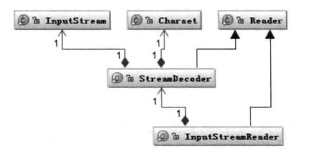
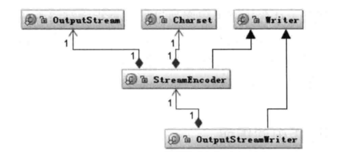

# 第三章	深入分析Java Web中的中文编码问题

***

&emsp;&emsp;编码问题在Java中更加明显，因为Java是跨平台语言，在不同平台的编码之间切换较多。

## 几种常见的编码形式

### 为什么要编码

- 在计算机中存储信息的最小单位是1个字节，即8个bit，所以能表示的字符范围为0—255个。
- 人类要表示的符号太多，无法用一个字节表示。

### 如何“翻译”

&emsp;&emsp;在计算机中提供了多种翻译<font color=teal>（编码）</font>方式，如：

- ASCII码
  - 共有128个，用一个字节的低7位表示，0-31是控制字符，如换行，回车，删除。32-126是打印字符。可以通过键盘输入并且能够显示出来。
- ISO-8859-1
  - 128个字符是不够用的，于是ISO组织在ACSII码基础上制定了一系列标准来拓展ASCII编码。
    - ISO-8859-1，涵盖了大多数西欧语言字符，应用广泛。其仍然是单字节编码，共能表示256个字符。
- GB2312
  - 全称是《信息技术 中文编码字符集》，是双字节编码，总的编码范围是A1-F7，其中A1-A9是符号区，总共包含682个字符；B0-F7是汉字区，包含6763个汉字。
- GBK
  - 全称是《汉字内码扩展规范》，是国家技术监督局为Windows 95制定的新的汉字内码规范，它的出现是为了拓展GB2312，并加入更多的汉字。
- GB18030
  - 全称是《信息技术 中文编码字符集》，是我国的强制标准，它可能是单字节、双字节或者是四字节编码。其与GB2312编码兼容，但其在实际应用系统中使用的并不广泛。
- UTF-16
  - ISO试图创建一个全新的超语言字典。Unicode是Java和XML的基础。其用两个字节来表示Unicode的转化格式。两个字节是16bit，这也是UTF-16名字的由来。
- UTF-8
  - UTF-16统一采用两个字节来表示一个字符，这导致很大一部分用一个字节可以表示的字符现在要用两个来表示。所以UTF-8采用了一种变长技术，每个编码区域有不同的字码长度。<font color=gold>不同的字符可以由1-6个字节组成。</font>
  - UTF-8有一下编码规则
    - 如果是1个字节，最高位（第8位）为0，则表示着是1个ASCII字符（00-7F）。<font color=teal>这也说明所有ASCII编码已经是UTF-8了</font>。
    - 如果是一个字节，以11开头，则连续的1的个数暗示这个字符的字节数，如：110xxxxx代表它是双字节UTF-8字符的首字节。
    - 如果是一个字节，以10开头，表示它不是首字节，则需要向前查找才能得到当前字符的首字节。

## 在Java中需要编码的场景

### 在I/O操作中存在的编码

&emsp;&emsp;涉及编码的地方一般都在从字符到字节或者从字节到字符上，而需要这种转换的场景主要是I/O，包括磁盘I/O和网络I/O。下图是Java中处理I/O问题的接口。



&emsp;&emsp;Reader类是在Java的I/O中读字符的父类，而InputStream类是读字节的父类。<font color=teal>InputStreamReader类</font>就是关联字节到字符的桥梁，它负责在I/O过程中处理读取字节到字符的转换，而对具体字节到字符的解码实现，它有委托<font color=red>StreamDecoder</font>去做，在StreamDecoder解码过程中，必须由用户指定Charset编码格式。值得注意的是，如果没有指定Charset，则将使用本地环境中的默认字符集，如在中文环境中将使用GBK编码。

&emsp;&emsp;写的情况和读类似，字符的父类是Writer，字节的父类是OutputStream，通过<font color=skyblue>OutputStreamWriter</font>转换字符到字节，如下图所示。



&emsp;&emsp;同样，StreamEncoder类负责将字符编码成字节，编码格式和默认编码规则与解码是一致的。下面是一段实现了文件读写功能的代码。

```java
String file = "c:/stream.txt";
String charset = "UTF-8";
// 写字符转换成字节流
FileOutputStream outputStream = new FIleOutputStream(file);
OutputStreamWriter writer = new OutputStreamWriter(outputStream, charset);
try {
  writer.write("这是要保存的中文字符");
} finally {
  writer.close();
}
// 读取字节转换为字符
FileInputStream inputStream = new FileInputStream(file);
InputStreamReader reader = new InputStreamReader(inputStream, charset);
StringBuffer buffer = new StringBuffer();
char[] buf = new char[64];
try {
  while ((count = reader.read(buf)) != -1) {
    buffer.append(buffer, 0, count);
  }
} finally {
  reader.close();
}
```

&emsp;&emsp;一般在应用程序中，涉及I/O操作时要注意指定<font color=red>相同</font>的Charset字符集。

### 在内存操作中的编码

&emsp;&emsp;在Java开发中除了I/O操作设计编码外，最常见的是在内存中进行从字符到字节的数据类型转换，在Java中用String表示字符串，所以String类提供了转换到字节的方法，也支持将字节转换为字符串的构造函数，代码如下。

```java
String s = "这是一段中文字符串";
byte[] b = s.getBytes("UTF-8");
String n = new String(b, "UTF-8");
```

&emsp;&emsp;同时，Charset类也提供encode与decode方法，分别对应char[]到byte[]的编码和byte[]到char[]的解码。其代码如下。

```java
Charset charset = Charset.forName("UTF-8");
ByteBuffer byteBuffer = charset.encode(string);
CharBuffer charBuffer = charset.decode(byteBuffer);
```

&emsp;&emsp;如上述代码所示，编码和解码都在一个类中完成，通过forName设置编解码字符集，这样更容易实现统一编码格式。

&emsp;&emsp;在Java中还有一个ByteBuffer类，它提供了一种char和byte之间的软转换，它们之间不需要编码和解码，只是把一个16bit的char拆为2个8bit的byte表示，它们的实际值并没有改变，仅仅是数据的类型做了转换，代码如下：

```java
ByteBuffer heapByteBuffer = ByteBuffer.allocate(1024);
ByteBuffer byteBuffer = heapByteBuffer.putChar(c);
```

## 在Java中如何编码

&emsp;&emsp;这里将用实际例子介绍Java中如何实现编码和解码，以"I am 君山"这个字符穿为例子。代码如下：

```java
public static void encode() {
  String name = "I am 君山";
  toHex(name.toCharArray());
  try {
    byte[] iso8859 = name.getBytes("ISO-8859-1");
    toHex(iso8859);
    byte[] gb2312 = name.getBytes("GB2312");
    toHex(gb2312);
    byte[] gbk = name.getBytes("GBK");
    toHex(gbk);
    byte[] utf16 = name.getBytes("UTF-16");
    toHex(utf16);
    byte[] utf8 = name.getBytes("UTF-8");
    toHex(utf8);
  } catch (UnsupportedEncodingException e) {
    e.printStackTrace();
  }
}
```

