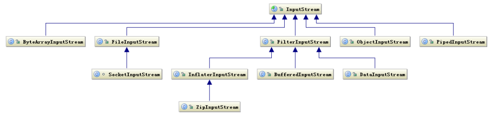
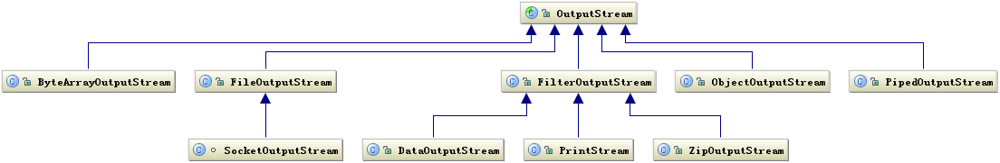

# 第二章	深入分析Java I/O的工作机制

***

&emsp;&emsp;I/O问题是当今Web应用中所面临的主要问题。

## Java的I/O类库的基本架构

<!--more-->

&emsp;&emsp;I/O问题是任何编程语言都无法回避的问题。

&emsp;&emsp;Java的I/O操作类在java.io包下，大概有奖金80个类，这些类大概可以分成4组。

- <font color=red>基于字节操作的I/O接口：</font>InputStream和OutputStream
- <font color=teal>基于字符操作的I/O接口：</font>Writer和Reader
- <font color=red>基于磁盘操作的I/O操作：</font>File
- <font color=teal>基于网络操作的I/O接口：</font>Socket

&emsp;&emsp;前两组主要是<font color=red>传输数据的格式</font>，后两组主要是<font color=teal>传输数据的方式</font>，虽然Socket类并不在java.io包下，因为个人（本书作者）认为I/O的核心问题要么是数据格式影响I/O操作，要么是传输方式影响I/O操作，<font color=yellow>也就是将什么样的数据写到什么地方的问题</font>。

### 基于字节的I/O操作接口

&emsp;&emsp;基于字节的I/O操作接口输入和输出分别是<font color=red>InputStream</font>和<font color=teal>OutputStream</font>，InputStream的类层次结构如下图所示。



&emsp;&emsp;输入流根据<font color=red>数据类型</font>和<font color=teal>操作方式</font>又被划分为若干个子类，每个子类分别处理不同的操作类型。

&emsp;&emsp;输出流OutputStream的层次结构与输入流InputStream类似，如下图所示。



&emsp;&emsp;有两点值得注意：

- <font color=red>操作数据的方式是可以组合使用的</font>

```java
OutputStream out = new BufferedOutputStream(new ObjectOutputStream(new FileOutputStream("filename")));
```

- <font color=teal>必须要指定流最终写到什么地方，要么写到磁盘，要么是写到网络中</font>

&emsp;&emsp;写网络其实也是写文件的一种，只不过写网路还有一步处理，让底层操作系统将数据传送到其他地方而非本地。

### 基于字符的I/O操作接口

