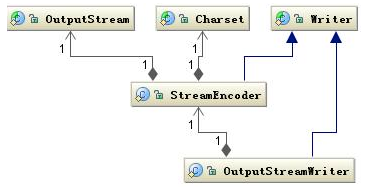
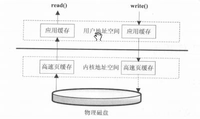

# 第二章	深入分析Java I/O的工作机制

***

&emsp;&emsp;I/O问题是当今Web应用中所面临的主要问题。

## Java的I/O类库的基本架构

<!--more-->

&emsp;&emsp;I/O问题是任何编程语言都无法回避的问题。

&emsp;&emsp;Java的I/O操作类在java.io包下，大概有奖金80个类，这些类大概可以分成4组。

- <font color=red>基于字节操作的I/O接口：</font>InputStream和OutputStream
- <font color=teal>基于字符操作的I/O接口：</font>Writer和Reader
- <font color=red>基于磁盘操作的I/O操作：</font>File
- <font color=teal>基于网络操作的I/O接口：</font>Socket

&emsp;&emsp;前两组主要是<font color=red>传输数据的格式</font>，后两组主要是<font color=teal>传输数据的方式</font>，虽然Socket类并不在java.io包下，因为个人（本书作者）认为I/O的核心问题要么是数据格式影响I/O操作，要么是传输方式影响I/O操作，<font color=yellow>也就是将什么样的数据写到什么地方的问题</font>。

### 基于字节的I/O操作接口

&emsp;&emsp;基于字节的I/O操作接口输入和输出分别是<font color=red>InputStream</font>和<font color=teal>OutputStream</font>，InputStream的类层次结构如下图所示。


&emsp;&emsp;输入流根据<font color=red>数据类型</font>和<font color=teal>操作方式</font>又被划分为若干个子类，每个子类分别处理不同的操作类型。

&emsp;&emsp;输出流OutputStream的层次结构与输入流InputStream类似，如下图所示。


&emsp;&emsp;有两点值得注意：

- <font color=red>操作数据的方式是可以组合使用的</font>

```java
OutputStream out = new BufferedOutputStream(new ObjectOutputStream(new FileOutputStream("filename")));
```

- <font color=teal>必须要指定流最终写到什么地方，要么写到磁盘，要么是写到网络中</font>

&emsp;&emsp;写网络其实也是写文件的一种，只不过写网络还有一步处理，让底层操作系统将数据传送到其他地方而非本地。

### 基于字符的I/O操作接口

&emsp;&emsp;<font color=red>不管是磁盘还是网络传输，最小的存储单位都是字节，而不是字符</font>。增加操作字符的I/O接口的理由，通常程序中操作的数据都是字符形式的，从字符到字节必须要经过编码转换，而编码比较耗时。

&emsp;&emsp;写字符的I/O操作类如下图所示，Writer类提供了一个抽象方法*write(char cbuf[], int off, int len)*。


&emsp;&emsp;读字符串的操作接口也有类似的类结构。


&emsp;&emsp;读字符串的操作接口是*int read(char chuff[], int off, int len)*，返回读到的n个字节数。

&emsp;&emsp;不管是Writer还是Reader类，它们都只定义了读取或写入的数据字符的方式，并没有规定数据要写到哪里。

### 字节与字符的转换接口

&emsp;&emsp;数据持久化或网络传输都是以字节进行的，所以必须要有从字符到字节或字节到字符的转换。

&emsp;&emsp;读的转化过程如下图所示。


&emsp;&emsp;InputStreamReader类使用字节到字符的转化桥梁，从InputStream到Reader的过程要制定编码字符集，否则将采用操作系统默认的字符集，<font color=teal>很可能出现乱码的情况</font>，StreamDecoder是字节到字符的解码的实现类。也就是，如果用下面的代码读取一个文件时：

```java
try {
  StringBuffer str = new StringBuffer();
  char[] buf = new char[1024];
  FileReader f = new FileReader("file");
  while (f.read(buf) > 0) {
    str.append(buf);
  }
}
```

&emsp;&emsp;FileReader类按照上图读取文件，FileReader继承了InputStreamReader，读取文件流，然后通过StreamDecoder解码成char，这里的解码字符为默认字符集。

写入也是类似的过程。



&emsp;&emsp;通过OutputSteamWriter类完成了从字符到字节的编码过程，由StreamEncoder完成编码过程。

## 磁盘I/O工作机制

### 几种访问文件的方式

&emsp;&emsp;读取和写入都会调用操作系统提供的接口，只要是系统调用就可能会存在<font color=teal>内核空间地址和用户空间地址切换的问题</font>，这是为了保护内核程序运行的安全性，但是这也存在数据可能需要从内核空间向用户空间复制的问题。

&emsp;&emsp;如果遇到非常耗时的操作，如复制，数据需要从用户空间复制到内存空间，又从内存空间复制到用户空间，将会非常缓慢，为了加速I/O访问，<font color=teal>操作系统会在内核空间使用缓存机制，也就是将从磁盘读的文件按照一定的组织方式进行缓存</font>，如果用户程序访问的是同一段磁盘地址的空间数据，那么操作系统将从内核缓存中直接取出返回给用户程序，减少I/O的响应时间。

- <font color=red>标准访问文件的方式</font>

&emsp;&emsp;标准访问文件的方式是，当应用程序调用read()接口时，操作系统检查在内核的告诉缓存中有没有需要的数据，如果已经缓存了，就直接从缓存中获取。如果没有，则从磁盘中读取，<font color=red>然后缓存在操作系统的缓存中</font>。

&emsp;&emsp;写入的方式是，当用户的应用程序调用write()接口将数据从用户地址空间复制到内核地址空间的缓存中，这是对<font color=teal>用户应用程序而言</font>写操作已经完成，至于什么时候写入到磁盘中由<font color=red>操作系统</font>决定，除非显式调用<font color=teal>sync</font>同步命令。

&emsp;&emsp;标准访问文件的方式如下图所示。



- <font color=teal>直接I/O的方式</font>

&emsp;&emsp;所谓的直接I/O的方式就是应用程序直接访问磁盘数据，而不经过操作系统内核数据缓冲区，这样做的目的就是减少一次从内核缓冲区到用户缓存的数据复制。<font color=red>这种访问文件的方式，通常是在对数据的缓存管理由应用程序实现的数据库管理系统中。</font>如在数据库管理系统中，系统明确地知道应该缓存哪些数据，应该失效哪些数据，还可以对一些热点数据做预加载，提前将热点数据加载到缓存中，可以加速数据的访问效率。在这些情况下， 如果是由<font color=teal>操作系统进行缓存，则很难做到，因为操作系统并不知道哪些是热点数据，哪些数据只会访问一次就不会再访问，操作系统知识简单地缓存最近一次从硬盘中读取的数据。

&emsp;&emsp;但是直接I/O也有负面影响，如果访问的数据不在应用程序缓存中，那么每次数据都要直接从硬盘加载，这种直接加载会非常缓慢。通常直接I/O会与<font color=teal>异步I/O</font>结合使用，会得到比较好的性能。

&emsp;&emsp;直接I/O的方式如下图所示。


- <font color=yellow>同步访问文件的方式</font>

&emsp;&emsp;数据的读取和写入都是同步操作的，它与<font color=teal>标准访问文件的方式</font>不同的是，只有当数据被成功写入到磁盘才返回给应用程序成功的标志。

&emsp;&emsp;这种访问文件的方式性能比较差，只有在一些对数据安全性要求比较高的场景中才会使用，而且通常这种操作方式的硬件都是定制的。

&emsp;&emsp;同步访问文件的方式如下图所示。


- <font color=pink>异步访问文件的方式</font>

&emsp;&emsp;异步访问文件的方式就是当访数据的线程发出请求之后，线程会接着去处理其他事情，而不是阻塞等待，当请求的数据返回后继续处理下面的事情。<font color=teal>这种访问文件的方式可以明显提高应用程序的效率，但是不会改变访问文件的效率。</font>

&emsp;&emsp;异步访问文件的方式如下图所示。


- <font color=blue>内存映射的方式</font>

&emsp;&emsp;内存映射的方式是指操作系统将内存的某一块区域与磁盘中的文件相关联起来，当要访问内存中的一段数据时，转换为访问文件的某一段数据。这种方式的目的同样是减少数据从内核空间缓存到用户空间缓存到数据复制操作，这两个空间的数据是共享的。


### Java访问磁盘文件

- 数据在磁盘中的唯一最小描述就是文件，上层应用程序只能通过文件来操作磁盘上的数据，文件也是操作系统和磁盘驱动器交互的最小单元。
- Java中的File并不代表一个真实存在的文件对象，当你指定一个路径描述符时，它会返回一个代表这个路径的虚拟对象，这个可能是一个真实存在的文件或者是一个包含多个文件的目录。
- 在真正读取这个文件时，会检查一个文件是否存在。
- FileInputStream类是操作一个文件的接口，在创建一个FileInputStream对象时会创建一个FileDescriptor对象，这个对象代表一个真正存在的文件对象的描述。
- 可以使用*getFD()*方法获取真正操作的与底层操作系统相关联的文件描述（FileDescriptor）。

&emsp;&emsp;读取文件的实例：

- 当传入一个文件路径时，会根据这个路径创建一个File对象来表示这个文件
- 根据这个File对象创建真正读取文件的操作对象，这时会<font color=red>真正创建一个关联真实存在的磁盘文件的文件描述符FileDescroptor</font>，通过这个对象可以直接控制这个磁盘文件
- 设读取的是字符格式，则需要StreamDecoder类将byte解码成char格式。
  - <font color=teal>操作系统会帮助完成从磁盘驱动器上读取一段数据。</font>不同的操作系统有着不同的文件系统。

&emsp;&emsp;从磁盘读取文件流程如下图所示。


### Java序列化技术

&emsp;&emsp;Java序列化就是将一个对象转化成一串二进制表示的字节数组，通过保存或转移这些字节数据来达到持久化的目的。<font color=yellow>需要持久化，对象必须继承Serializable接口，</font>反序列化则是相反的过程，可以将这个字节数组重新构造成为对象，<font color=teal>在反序列化时，必须有原始类作为模版。由此可以，<font color=red>序列化的数据并不像class文件那样保存类的完整的结构信息。</font>如下代码示例：

```java
public class Serialize implements Serializable {
  private static final long serialVersionUID = -6849794470754660011L;
  public int num = 1390;
  public static void main(String[] args) {
    try {
      FileOutputStream fos = new FileOutputStream("~/serialize.dat");
      ObjectOutputStream oos = new ObjectOutputStream(fos);
      Serialize serialize = new Serialize();
      oos.writeObject(serialize);
      oos.flush();SerializedFileBinaryByteData.png
      oos.close();
    } catch (IOException e) {
      e.printStackTrace();
    }
  }
}
```

&emsp;&emsp;序列化的文件二进制字节数据如下：


- 第一部分是序列化头文件
  - AC ED: STREAM_MAGIC 声明使用了序列化协议
  - 00 05: STREAM_VERSION 序列化协议版本
  - 73: TC_OBJECT 声明这是一个新的对象
- 第二部分是要序列化的类的描述，在这里是Serialize类
  - 72: TC_CLASSDESC 声明这里开始一个新的ckass
  - 00 11: class名字的长度是17字节
  - 63 6F 6D 70 69 6C 65 2E 53 65 72 69 61 6C 69 7A 65: Serialize的完整类名
  - A0 F0 A4 38 7A 3B D1 55: SerialVersionUID, 序列化ID, 如果没有制定. 则会由算法随机生成一个8字节的ID
  - 02: 标记号, 该值声明该对象支持序列化
  - 00 01: 该类所包含的域的个数为1
- 第三部分是对象中各个属性的描述项
  - 49: 域类型，49代表"I"，也就是Int类型
  - 00 03: 域名字的长度，为3
  - 6E 75 6D: num属性的名字
- 第四部分输出该对象的父类信息描述，这里没有父类，如果有，则数据格式与第二部分一样
  - 78: TC_ENDBLOCKDATA，对象块结束的标志
  - 70: TC_NULL，说明没有其他超类的标志
- 第五部分输出对象的属性项的实际值，如果属性项是一个对象，那么这里还将序列化这个对象，规则和第二部分一样
  - 00 00 05 6E: 1390的数值

&emsp;&emsp;虽然Java的序列化能够保证对象状态的持久保存，但是遇到一些对象结构复杂的情况还是比较难以处理的，下面是一些复杂情况的总结。

- <font color=red>当父类继承*Serializable*接口时，所有子类都可以被序列化。</font>
- <font color=teal>子类实现了Serializable接口，父类没有，父类中的属性不能被序列化（不报错，数据会丢失），但是在子类中属性仍能被正确序列化。</font>
- <font color=yellow>如果序列化的属性是对象，则这个对象也必须实现Serializable接口，否则会报错。</font>
- <font color=pink>在反序列化时，如果对象的属性有修改或删减，则修改的部分属性会丢失，但不会报错。</font>
- <font color=orange>在反序列化时，如果serialVersionUID被修改，则反序列化时会失败。</font>

&emsp;&emsp;在纯Java环境下，Java序列化能够很好的工作，但是在多语言环境下，用Java序列化存储后，很难用其他语言还原出结果，在这种情况下，推荐使用通用的数据结构，如JSON或者XML结构数据。工具：Google的protobuf等。

## 网络I/O工作机制

&emsp;&emsp;数据从一代主机发送到网络中的另一台主机需要经过很多步骤。

- 沟通意向
- 物理链路
- 通信协议

&emsp;&emsp;本节重点是通信协议和完成数据传输。

### TCP状态转化

&emsp;&emsp;如何建立和关闭一个TCP连接，TCO连接的状态转化如下图所示。


- （1）CLOSED：起始点，在超时或者连接关闭时进入此状态。
- （2）LISTEN：Server端在等待连接时的状态，Server端此时会调用Socket、bind、listen函数，这被称之为应用程序被动打开（等待客户端连接）。
- （3）SYN-SENT：客户端发起连接，发送SYN（同步序列编号，*Syn*chronize Sequence Numbers）给服务器端。如果服务器端不能连接，则直接进入CLOSED状态。
- （4）SYN-RCVD：与（3）对应，服务器接受客户端的SYN请求，服务端由LISTEN状态进入SYN-RCVD状态。同时服务器要回应一个ACK（确认字符，*Ack*nowledge character），发送一个SYN给客户端；另外一种情况是，客户端在发起SYN端同时接收到服务器端的SYN请求，客户端会由SYN-SENT状态转换到SYN-RCVD状态。
- （5）ESTABLISHED：服务器端和客户端在完成3次握手后进入建立状态，说明已经可以传输数据了。
- （6）FIN-WAIT-1：主动关闭的一方，由状态5进入此状态。具体动作是发送FIN给对方。
- （7）FIN-WAIT-2：主动关闭的一方，接收到对方的FIN ACK，进入此状态。由此不能再接收对方的数据，但是能够向对方发送数据。
- （8）CLOSE-WAIT：接收到FIN以后，被动关闭的一方进入此状态。具体动作是在接收到FIN的同时发送ACK。
- （9）LAST-ACK：被动关闭的一方，发起关闭请求，由状态（8）进入此状态。具体动作是发送FIN给对方，同时在接收到ACK时进入CLOSED状态。
- （10）CLOSING：两边同时发起关闭请求时，会由FIN-WAIT-1进入此状态。具体动作是接收到FIN请求，同时响应一个ACK。
- （11）TIME-WAIT：这个状态比较复杂，也是最常见的一个状态，有3个状态可以转化为此状态。
  - 由FIN-WATI-2转换到TIME-WAIT，具体情况是：在双方不同时发起FIN的情况下，主动关闭的一方在完成自身发起的关闭请求后，接收到被动关闭一方的FIN后进入的状态。
  - 由CLOSING转换到TIME-WAIT，具体情况是：在双方同时发起关闭，都做了发起FIN的请求，同时接收到了FIN并做了ACK的情况下，这时就由CLOSING状态进入TIME-WAIT状态。
  - 由FIN-WAIT-1转换到TIME-WAIT，具体情况是：同时接收到FIN（对方发起）和ACK（本身发起的FIN的回应），它与CLOSING转换到TIME-WAIT的区别在于，本身发起的FIN回应的ACK先于对方的FIN请求到达，而由CLOSING转换到TIME-WAIT则是FIN先到达。

&emsp;&emsp;搞清楚TCP连接到几种状态转换是很有帮助的，如TCP网络参数调优。

### 影响网络传输的因素

&emsp;&emsp;将一份数据从一个地方正确地传输到另一个地方所需要的时间称之为响应时间。影响的因素常见的有：

- 网络带宽：一条物理链路在1s内能够传输的最大比特数。
- 传输距离：
- TCP拥塞控制：带宽延迟乘积，拥塞控制，TCP缓冲区的大小。带宽 * RTT（Round-Trip Time，数据在两端的来回时间，也就是响应时间）。<font color=green>//？</font>。

### Java Socket的工作机制

&emsp;&emsp;Socket这个概念没有具体对应的实体，它描述的是计算机之间完成相互通信的一种抽象功能。Socket有许多种实现方式，最常见的就是基于TCP/IP的流套接字，这是一种稳定的通信协议。典型的基于Socket的通信场景。


&emsp;&emsp;如图所示，主机A的应用程序要能和主机B的应用程序通信，必须要通过Socket建立连接，而建立Socket连接必须由底层TCP/IP协议来建立TCP连接。建立TCP连接需要底层IP来寻址网络中的主机，用端口号来指定主机中不同的应用程序。以上，就可以通过Socket实例来指定代表唯一一个主机上的应用程序的通信链路了。

### 建立通信链路

&emsp;&emsp;当客户端要与服务器端通信时，客户端首先要创建一个Socket实例，操作系统将为这个Socket实例分配一个没有被使用的本地端口号，并创建一个包含本地地址、远程地址和端口号的套接字数据结构，<font color=teal>这个数据结构将一直保存在系统中直到这个连接关闭。</font>在创建Socket实例的构造函数正确返回<font color=red>之前</font>（Socket依赖于TCP/IP协议），需要进行TCP的三次握手，TCP握手协议完成后，Socket实例对象将创建完成，否则将抛出IOException错误。

