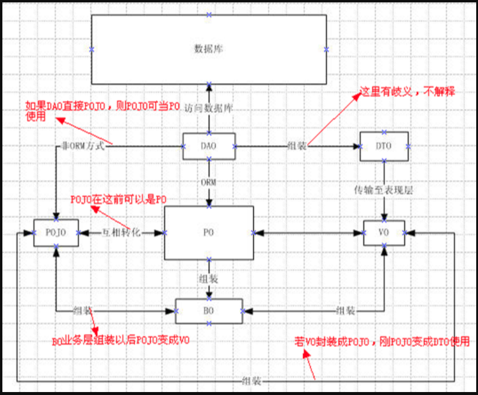

# Java实体类包名问题

***

## Entity

&emsp;&emsp;最常用实体类，基本和数据表一一对应，一个实体一张表。

<!--more-->

## BO(Business Object)

&emsp;&emsp;代表业务对象的意思，Bo就是把业务逻辑封装为一个对象（注意是逻辑，业务逻辑），这个对象可以包括一个或多个其它的对象。通过调用Dao方法，结合Po或Vo进行业务操作。

&emsp;&emsp;形象描述为一个对象的形为和动作，当然也有涉及到基它对象的一些形为和动作。比如处理一个人的业务逻辑，该人会睡觉，吃饭，工作，上班等等行为，还有可能和别人发关系的行为，处理这样的业务逻辑时，我们就可以针对BO去处理。

&emsp;&emsp;再比如投保人是一个Po，被保险人是一个Po，险种信息也是一个Po等等，他们组合起来就是一张保单的Bo。

## VO(Value Object)

&emsp;&emsp;代表值对象的意思，通常用于业务层之间的数据传递，由new创建，由GC回收。主要体现在视图的对象，对于一个WEB页面将整个页面的属性封装成一个对象，然后用一个VO对象在控制层与视图层进行传输交换。

## PO(Persistant Object)

&emsp;&emsp;代表持久层对象的意思，对应数据库中表的字段，数据库表中的记录在java对象中的显示状态，最形象的理解就是一个PO就是数据库中的一条记录。

&emsp;&emsp;其好处是可以把一条记录作为一个对象处理，可以方便的转为其它对象。Vo和Po，都是属性加上属性的get和set方法；表面看没什么不同，但代表的含义是完全不同的。

## DTO(Data Transfer Object)

&emsp;&emsp;代表数据传输对象的意思。

&emsp;&emsp;其是一种设计模式之间传输数据的软件应用系统，数据传输目标往往是数据访问对象从数据库中检索数据。

&emsp;&emsp;数据传输对象与数据交互对象或数据访问对象之间的差异是一个以不具任何行为除了存储和检索的数据（访问和存取器）。
&emsp;&emsp;简而言之，就是接口之间传递的数据封装。

&emsp;&emsp;表里面有十几个字段：id，name，gender（M/F)，age……

&emsp;&emsp;页面需要展示三个字段：name，gender(男/女)，age

&emsp;&emsp;DTO由此产生，一是能提高数据传输的速度(减少了传输字段)，二能隐藏后端表结构

## POJO(Plian Ordinary Java Object)

&emsp;&emsp;代表简单无规则java对象

&emsp;&emsp;纯的传统意义的java对象，最基本的Java Bean只有属性加上属性的get和set方法

&emsp;&emsp;可以额转化为PO、DTO、VO；比如POJO在传输过程中就是DTO。

## DAO(Data Access Object)

&emsp;&emsp;代表数据访问对象的意思，是sun的一个标准j2ee设计模式的接口之一，负责持久层的操作 。这个基本都了解，DAO和上面几个O区别最大，基本没有互相转化的可能性和必要，主要用来封装对数据的访问，注意，是对数据的访问，不是对数据库的访问。

## 各个实体类包名的联系

## Controller

&emsp;&emsp;代表控制层，主要是Action/Servlet等构成（Spring MVC则是通过@Controller标签使用）此层业务层与视图层打交道的中间层，负责传输VO对象和调用BO层的业务方法，负责视图层请求的数据处理后响应给视图层。

## View

&emsp;&emsp;代表视图层的意思，主要是指由JSP、HTML等文件形成的显示层。

## 实际项目
- 控制层(controller-action)
- 业务层/服务层( bo-manager-service
- 实体层(po-entity)
- dao(dao)
- 视图对象(Vo)
- 视图层(view-jsp/html)

## 注意

- 实际使用中，实体类包名自己分得清楚就可以了。