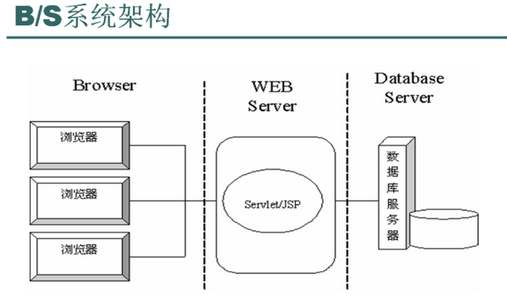

# 第一章	深入Web请求过程

***

## B/S架构的好处

- 客户端使用统一的浏览器（Browser）

<!--more-->

- 服务端基于统一的HTTP（协议）

## B/S架构概述

&emsp;&emsp;B/S网络架构从前端到后端都得到了简化，都基于统一的应用层协议HTTP来交互数据，这与大多数传统的C/S互联网应用采用的长连接的交互模式不同，HTTP采用无状态的短连接的通信方式。

&emsp;&emsp;通常情况下，一次请求就完成了一次数据交互，通常也对应一个业务逻辑，然后这次通信连接就断开了。采用这种方式是为了能够同时服务更多的用户。

&emsp;&emsp;当一个用户在浏览器中输入一个URL时，如*www.github.com*，将发生很多操作。

- 首先，DNS会把这个域名解析成对应的IP地址
- 然后，根据这个IP地址在互联网上找到对应的服务器
- 随后，发起一个请求给服务器
- 最后，服务器返回默认的数据资源给访问的用户

&emsp;&emsp;不管网络结构如何变化，始终有一些固定不变的原则。

- 所有互联网上的资源都要用一个URL来表示，URL就是统一资源定位符。
- 必须基于HTTP与服务端进行交互。
- 数据展示必须在浏览器中进行。

## 如何发起一个请求

&emsp;&emsp;发起一个请求和建议一个Socket连接类似，只不过其outputStream.write写的二进制字节数据格式要符合HTTP。

- 浏览器在建立Socket连接之前，必须根据地址栏中的URL解析（DNS）出相应的的IP地址，在根据地址和端口号与远程服务器建立Socket连接。
- 浏览器会根据这个URL组成一个get烈性的HTTP请求，通过outputStrem.write发送到目标服务器，服务器等待inputStream.read返回数据。
- 最后断开这个连接。

## HTTP解析

&emsp;&emsp;B/S网络架构的核心是HTTP，掌握HTTP对一个从事互联网工作的程序员来说非常重要

&emsp;&emsp;要理解HTTP，最重要的就是熟悉HTTP中的HTTP Header，HTTP Header控制着互联网上成千上万的用户数据的传输。最关键的是，它控制着用户浏览器的渲染行为和服务器的执行逻辑。

&emsp;&emsp;例如，当服务器没有用户请求的数据时就会返回一个404状态码，告诉浏览器没有要请求的数据，通常浏览器就会展示一个该页面不存在的错误信息。

&emsp;&emsp;常见的HTTP请求头和响应头分别如下所示。

- 常见的HTTP请求头

  |     请求头      |                             作用                             |
  | :-------------: | :----------------------------------------------------------: |
  | Accept-Charset  |                  用于指定客户端接收的字符集                  |
  | Accept-Encoding |   用于指定可接受的内容编码：如Accept-Econding:gzip.deflate   |
  | Accept-Language |                           用于指定                           |
  |      Host       | 用于指定被请求资源的Internet主机号和端口号，如Host: *www.github.com* |
  |   User-Agent    |       客户端将它的操作系统、浏览器和其他属性告负服务器       |
  |   Connection    |          当前连接是否保持，如Connetcion:Keep-Alive           |

- 常见的HTTP响应头

  |      响应头      |                             作用                             |
  | :--------------: | :----------------------------------------------------------: |
  |      Server      |        使用的服务器名称，如Server: Apache/1.3.6(Unix)        |
  |   Content-Type   | 用来指明发送给接收者的实体正文的媒体类型，如Content-Type: text/html;charset=GBK |
  | Content-Encoding | 与请求头Accept-Encoding对应，告诉浏览器服务端采用的是什么压缩编码 |
  | Content-Language |       描述了资源所用的自然语言，与Accept-Language对应        |
  |  Content-Length  |    指明实体正文的长度，用以字节方式存储的十进制数字来表示    |
  |   Keep-Alives    |        保持连接时间，如Keep-Alive: timeout=5, max=120        |

- 常见的HTTP状态码

  | 状态码 |                 说明                 |
  | :----: | :----------------------------------: |
  |  200   |            客户端请求成功            |
  |  302   | 临时跳转，跳转的地址通过Location指定 |
  |  400   | 客户端请求有语法错误不能被服务器识别 |
  |  403   |    服务器收到请求，但拒绝提供服务    |
  |  404   |           请求的资源不存在           |
  |  500   |       服务器发生不可预期的错误       |

###  查看HTTP信息的工具

- Firebug
- HttpFox
- 其他

### 浏览器缓存机制

&emsp;&emsp;浏览器缓存是一个比较复杂但又比较重要的的机制

&emsp;&emsp;对浏览器使用刷新之后，会请求服务端返回新的数据，最重要的是会在请求头中增加两个请求项，Pargma:no-cache和Cache-Control:no-cache。

1. Cache-Control/Pragma

- 这个HTTP Head字段用于指定所有缓存机制在整个请求/响应链中必须服从的指令，而no-cache顾名思义。

  HTTP head Pargmma / Cache-Control字段可选的value

  |                value                 |                             作用                             |
  | :----------------------------------: | :----------------------------------------------------------: |
  |                Public                |              所有内容都将被缓存，在响应头中设置              |
  |               Private                |            内容只缓存到私有缓存中，在响应头中设置            |
  |               no-cache               |         所有内容都不会被缓存，在请求头和响应头中设置         |
  |               no-store               | 所有内容都不会缓存到缓存或Internet临时文件中，在响应头中设置 |
  | must-revalidation/proxy-revalidation | 如果缓存的内容失效，请求必须发送到服务器/代理以进行重新验证，在请求头中设置 |
  |             max-age=xxx              | 缓存的内容将在xxx秒后失效，这个选项只在HTTP1.1中可用，和Last-Modified一起使用时，优先级较高，在响应头中设置 |

  - Cache-Control请求字段被各个浏览器支持得较好，优先级较高。
  - Pragma字段的作用和Cache-Control类似

2. Expires

&emsp;&emsp;Expires通常的使用格式是*Expires: Sat, 25 Feb 2012 12:22:17 GMT*，后面跟着一个日期和时间，超过这个时间后，缓存的内容将失效，也就是浏览器在发出请求之前检查这个页面的字段，看该页面是否已经过期了，过期了就重新向服务器发起请求。

3. Last-Modified/Etag

&emsp;&emsp;Last-Modified字段一般用于表示一个服务器上的资源的最后修改时间，资源可以是静态（静态内容自动加上Last-Modified字段）或者动态的内容（如Servlet提供了一个getLastModified方法用于检查某个动态内容是否已经更新），通过这个最后修改时间可以判断当前请求的资源是否是最新的。

&emsp;&emsp;与*Last-Modified*字段有类似功能的还有一个Etag字段，这个字段的作用是让服务器给每个页面分配一个唯一的编号，然后通过这个编号来区分当前这个页面是否是最新的。

## DNS域名解析

&emsp;&emsp;在互联网世界中，每个资源都是通过URL来发布和请求资源的，URL中的域名需要解析成IP地址才能与远程主机建立连接，DNS解析就是进行此项工作的。

### DNS域名解析过程

&emsp;&emsp;当一个用户在浏览器中输入*www.github.com*时，DNS解析大概会进行如下步骤。

1. 浏览器会检查缓存中有没有这个域名对应的解析过的地址，如果缓存中存在，解析过程结束。

2. 如果缓存中不存在，浏览器会查找系统缓存中是否有这个域名对应的DNS解析结果。（hosts文件）

3. 在网络配置中，一般都会存在“DNS服务器地址”，这个地址就用于以上两步都不存在缓存的情况。操作系统会将这个域名发送给这里设置的LDNS，也就是本地区的域名服务器，这个DNS通常都提供给你本地互联网接入的一个DNS解析服务。

   这个专门的域名解析服务器性能都较好，一般都会缓存域名解析结果，LDNS主要承担了域名解析的工作。

4. 如果LDNS仍然没有命中，就会到Root Server域名服务器请求解析。

5. Root Server域名服务器返回给本地域名服务器一个所查询域的主域名服务器（GTLD Server）地址。GTLD是国际顶级域名服务器，如.com，.cn，.org等，全球只有13台左右。

6. 本地域名服务器（Local DNS Server）再向上一步返回的GTLD服务器发送请求。

7. 接受请求的GTLD服务器查找并返回此域名对应的Name Server域名服务器的地址，这个Name Server通常就是你注册的域名服务器，例如你在某个域名服务提供商申请的域名，那个这个域名解析任务就由这个域名提供商的服务器完成。

8. Name Server域名服务器会查询存储的域名和IP的映射关系表，在正常情况下都根据域名得到目标IP记录，连同一个TTL值返回给Local DNS Server域名服务器。

9. 返回该域名对应的IP和TTL值，Local DNS Server会缓存这个域名和IP的对应关系，缓存的时间由TTL值控制。

10. 把解析的结果返回给用户，用户根据TTL值缓存在本地服务器中，域名解析过程结束。

&emsp;&emsp;在实际过程中，可能还有更多步骤，这只是一般情况，如Name Server可能有多级，GTM进行负载均衡设置等。

### 跟踪域名解析过程

&emsp;&emsp;在Linux和Windows下都可以使用nslookup命令来查询域名的解析结果。在Linux下还可以使用dig命令来查询DNS的解析过程。

### 清除缓存的域名

&emsp;&emsp;DNS域名解析有两个地方缓存解析结果，一个是Local DNS Server，另一个是用户的本地机器，这两个缓存都是TTL值和本地缓存大小控制的。但最大缓存时间是TTL值，基本上Local DNS Server的缓存时间很难人工介入。

&emsp;&emsp;本地缓存可以用如下方式进行清除

- Windows

  ipconfig/flushdns

- Linux

  /etc/init.d/nscd restart

&emsp;&emsp;在Java应用中JVM也会缓存DNS的解析结果，这个缓存由InetAddress类中完成，其缓存时间比较特殊。其有两种缓存策略。

- 正确解析结果缓存	有networkaddress.cache.ttl	默认为-1，永不失效
- 失败的解析结果缓存    networkaddress.cache.negative.ttl    默认为10，10秒失效

&emsp;&emsp;修改这两个值有几种方式

- 直接修改java.security文件中的默认值
- 在Java的启动参数中增加-Dsun.net.inetaddr.ttl=xxx来设置默认值
- 通过InetAddress类动态修改

&emsp;&emsp;如果需要使用InetAddress类解析域名，必须使用单例模式，不然会有严重的性能问题出现。

### 几种域名解析方式

&emsp;&emsp;域名解析记录主要分为以下几种方式

- A记录，Address，用来指定域名对应的IP地址。A记录可以将多个域名解析到一个IP地址，但不能将一个域名解析到多个IP地址。
- MX记录，Mail Exchange，可以将某个域名下的邮件服务器只想自己的Mail Server。如taobao.com的域名的A记录IP地址是155.238.25.xxx，如果将MX记录设置为155.238.25.xxx，即xxx@taobao.com的邮件路由，DNS会将邮件发送到155.238.25.xxx所在的服务器，而正常通过Web请求的话仍然可以解析到A记录的IP地址。
- CNAME记录，Canonical Name（别名解析）。其可以为一个域名设置一个或多个别名。
- NS记录，为某个域名指定DNS解析服务器。
- TXT记录，为某个主机名或域名设置说明。

## CND工作机制

&emsp;&emsp;CND，内容分布网络（Content Delivery Network），是构筑在现有Internet上的一种先进的流量分配网络。其目的是通过在现有的Internet中增加一层新的网络架构，使用户可以就近取得所需的内容，提高用户访问网络的想要速度。

&emsp;&emsp;CDN = Mirror + Cache + GSLB。其可以明显提高Internet中信息流动的效率。

&emsp;&emsp;通常来说，CDN以缓存网站中的静态数据为主。CDN一般会达到以下一个目标。

- 可拓展
- 安全性
- 可靠性、响应和执行（Reliability、Responsiveness和Performance）。

### CDN架构

&emsp;&emsp;一个用户访问某个静态文件，域名为cdn.taobao.com。

- 首先向Local DNS服务器发起请求
- 经过迭代解析后回到域名的注册服务器解析
- 指向CDN全局中的DNS负载均衡服务器
- GTM最终返回里这个访问用户最"近"的节点
- 用户去CND拿到静态文件

### 负载均衡

&emsp;&emsp;负载均衡（Load Balance）就是对工作任务进行平衡、分摊到多个操作单元上执行，共同完成任务。其可以提高服务器响应速度以及利用效率，避免软件或者硬件模块出现单点失效，解决网络拥塞问题，实现地理位置无关性，为用户提供较为一致的访问质量。

&emsp;&emsp;通常有三种负载均衡架构：

- 链路负载均衡：通过DNS解析成不同的IP，用户根据IP来访问不同的目标服务器
- 集群负载均衡：
  - 硬件负载均衡：使用一台专门的硬件设备来转发请求
  - 软件负载均衡：1. 在网络层利用IP地址进行地址转发。2. 根据访问用户的HTTP请求头来进行负载均衡
- 操作系统负载均衡：利用操作系统级别的软中断或者硬件中断来达到负载均衡，如可以设置多队列网卡灯。

&emsp;&emsp;CND、Web服务或者分布式数据集群中都可以使用，后两种较为常见。

### CND动态加速

&emsp;&emsp;CDN动态加速的技术原理是在CDN的DNS解析中通过动态的链路探测来寻找回源最好的一条路径，然后通过DNS的调度将所有请求调度到选定的这条路径上回源，从而加速用户的访问效率。

&emsp;&emsp;由于CDN节点遍布全球，所以当用户接入一个CDN节点后，可以选择一条从离用户最近的CND节点到源站链路最好的路径进行数据传输。

## 小结

- B/S结构
- 如何发起一个请求
- HTTP解析
- DNS域名解析
- CDN工作机制

## 参考资料

- 《深入分析Java Web技术内幕》，许令波.