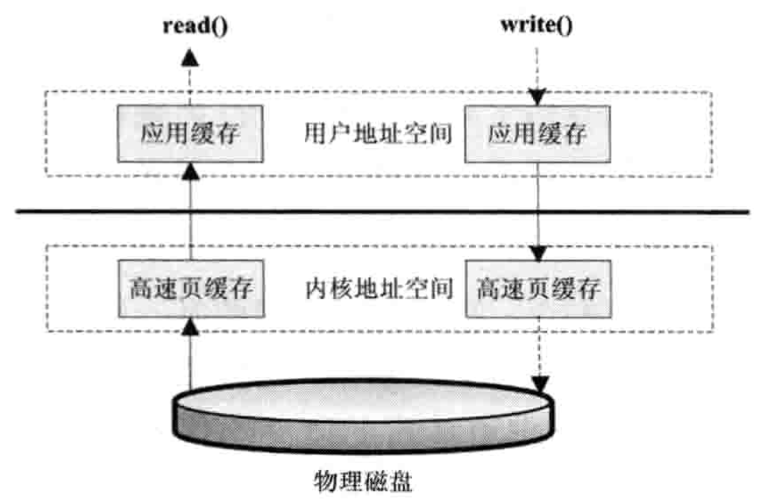

# 第二章	深入分析Java I/O的工作机制

***

&emsp;&emsp;I/O问题是当今Web应用中所面临的主要问题。

## Java的I/O类库的基本架构

<!--more-->

&emsp;&emsp;I/O问题是任何编程语言都无法回避的问题。

&emsp;&emsp;Java的I/O操作类在java.io包下，大概有奖金80个类，这些类大概可以分成4组。

- <font color=red>基于字节操作的I/O接口：</font>InputStream和OutputStream
- <font color=teal>基于字符操作的I/O接口：</font>Writer和Reader
- <font color=red>基于磁盘操作的I/O操作：</font>File
- <font color=teal>基于网络操作的I/O接口：</font>Socket

&emsp;&emsp;前两组主要是<font color=red>传输数据的格式</font>，后两组主要是<font color=teal>传输数据的方式</font>，虽然Socket类并不在java.io包下，因为个人（本书作者）认为I/O的核心问题要么是数据格式影响I/O操作，要么是传输方式影响I/O操作，<font color=yellow>也就是将什么样的数据写到什么地方的问题</font>。

### 基于字节的I/O操作接口

&emsp;&emsp;基于字节的I/O操作接口输入和输出分别是<font color=red>InputStream</font>和<font color=teal>OutputStream</font>，InputStream的类层次结构如下图所示。


&emsp;&emsp;输入流根据<font color=red>数据类型</font>和<font color=teal>操作方式</font>又被划分为若干个子类，每个子类分别处理不同的操作类型。

&emsp;&emsp;输出流OutputStream的层次结构与输入流InputStream类似，如下图所示。


&emsp;&emsp;有两点值得注意：

- <font color=red>操作数据的方式是可以组合使用的</font>

```java
OutputStream out = new BufferedOutputStream(new ObjectOutputStream(new FileOutputStream("filename")));
```

- <font color=teal>必须要指定流最终写到什么地方，要么写到磁盘，要么是写到网络中</font>

&emsp;&emsp;写网络其实也是写文件的一种，只不过写网络还有一步处理，让底层操作系统将数据传送到其他地方而非本地。

### 基于字符的I/O操作接口

&emsp;&emsp;<font color=red>不管是磁盘还是网络传输，最小的存储单位都是字节，而不是字符</font>。增加操作字符的I/O接口的理由，通常程序中操作的数据都是字符形式的，从字符到字节必须要经过编码转换，而编码比较耗时。

&emsp;&emsp;写字符的I/O操作类如下图所示，Writer类提供了一个抽象方法*write(char cbuf[], int off, int len)*。


&emsp;&emsp;读字符串的操作接口也有类似的类结构。


&emsp;&emsp;读字符串的操作接口是*int read(char chuff[], int off, int len)*，返回读到的n个字节数。

&emsp;&emsp;不管是Writer还是Reader类，它们都只定义了读取或写入的数据字符的方式，并没有规定数据要写到哪里。

### 字节与字符的转换接口

&emsp;&emsp;数据持久化或网络传输都是以字节进行的，所以必须要有从字符到字节或字节到字符的转换。

&emsp;&emsp;读的转化过程如下图所示。


&emsp;&emsp;InputStreamReader类使用字节到字符的转化桥梁，从InputStream到Reader的过程要制定编码字符集，否则将采用操作系统默认的字符集，<font color=teal>很可能出现乱码的情况</font>，StreamDecoder是字节到字符的解码的实现类。也就是，如果用下面的代码读取一个文件时：

```java
try {
  StringBuffer str = new StringBuffer();
  char[] buf = new char[1024];
  FileReader f = new FileReader("file");
  while (f.read(buf) > 0) {
    str.append(buf);
  }
}
```

&emsp;&emsp;FileReader类按照上图读取文件，FileReader继承了InputStreamReader，读取文件流，然后通过StreamDecoder解码成char，这里的解码字符为默认字符集。

写入也是类似的过程。


&emsp;&emsp;通过OutputSteamWriter类完成了从字符到字节的编码过程，由StreamEncoder完成编码过程。

## 磁盘I/O工作机制

### 几种访问文件的方式

&emsp;&emsp;读取和写入都会调用操作系统提供的接口，只要是系统调用就可能会存在<font color=teal>内核空间地址和用户空间地址切换的问题</font>，这是为了保护内核程序运行的安全性，但是这也存在数据可能需要从内核空间向用户空间复制的问题。

&emsp;&emsp;如果遇到非常耗时的操作，如复制，数据需要从用户空间复制到内存空间，又从内存空间复制到用户空间，将会非常缓慢，为了加速I/O访问，<font color=teal>操作系统会在内核空间使用缓存机制，也就是将从磁盘读的文件按照一定的组织方式进行缓存</font>，如果用户程序访问的是同一段磁盘地址的空间数据，那么操作系统将从内核缓存中直接取出返回给用户程序，减少I/O的响应时间。

- <font color=red>标准访问文件的方式</font>

&emsp;&emsp;标准访问文件的方式是，当应用程序调用read()接口时，操作系统检查在内核的告诉缓存中有没有需要的数据，如果已经缓存了，就直接从缓存中获取。如果没有，则从磁盘中读取，<font color=red>然后缓存在操作系统的缓存中</font>。

&emsp;&emsp;写入的方式是，当用户的应用程序调用write()接口将数据从用户地址空间复制到内核地址空间的缓存中，这是对<font color=teal>用户应用程序而言</font>写操作已经完成，至于什么时候写入到磁盘中由<font color=red>操作系统</font>决定，除非显式调用<font color=teal>sync</font>同步命令。

&emsp;&emsp;标准访问文件的方式如下图所示。


- <font color=teal>直接I/O的方式</font>

&emsp;&emsp;所谓的直接I/O的方式就是应用程序直接访问磁盘数据，而不经过操作系统内核数据缓冲区，这样做的目的就是减少一次从内核缓冲区到用户缓存的数据复制。<font color=red>这种访问文件的方式，通常是在对数据的缓存管理由应用程序实现的数据库管理系统中。</font>如在数据库管理系统中，系统明确地知道应该缓存哪些数据，应该失效哪些数据，还可以对一些热点数据做预加载，提前将热点数据加载到缓存中，可以加速数据的访问效率。在这些情况下， 如果是由<font color=teal>操作系统进行缓存，则很难做到，因为操作系统并不知道哪些是热点数据，哪些数据只会访问一次就不会再访问，操作系统知识简单地缓存最近一次从硬盘中读取的数据。

&emsp;&emsp;但是直接I/O也有负面影响，如果访问的数据不在应用程序缓存中，那么每次数据都要直接从硬盘加载，这种直接加载会非常缓慢。通常直接I/O会与<font color=teal>异步I/O</font>结合使用，会得到比较好的性能。

&emsp;&emsp;直接I/O的方式如下图所示。


- <font color=yellow>同步访问文件的方式</font>

&emsp;&emsp;数据的读取和写入都是同步操作的，它与<font color=teal>标准访问文件的方式</font>不同的是，只有当数据被成功写入到磁盘才返回给应用程序成功的标志。

&emsp;&emsp;这种访问文件的方式性能比较差，只有在一些对数据安全性要求比较高的场景中才会使用，而且通常这种操作方式的硬件都是定制的。

&emsp;&emsp;同步访问文件的方式如下图所示。


- <font color=pink>异步访问文件的方式</font>

&emsp;&emsp;异步访问文件的方式就是当访数据的线程发出请求之后，线程会接着去处理其他事情，而不是阻塞等待，当请求的数据返回后继续处理下面的事情。<font color=teal>这种访问文件的方式可以明显提高应用程序的效率，但是不会改变访问文件的效率。</font>

&emsp;&emsp;异步访问文件的方式如下图所示。



- <font color=blue>内存映射的方式</font>

&emsp;&emsp;内存映射的方式是指操作系统将内存的某一块区域与磁盘中的文件相关联起来，当要访问内存中的一段数据时，转换为访问文件的某一段数据。这种方式的目的同样是减少数据从内核空间缓存到用户空间缓存到数据复制操作，这两个空间的数据是共享的。


### Java访问磁盘文件

- 数据在磁盘中的唯一最小描述就是文件，上层应用程序只能通过文件来操作磁盘上的数据，文件也是操作系统和磁盘驱动器交互的最小单元。
- Java中的File并不代表一个真实存在的文件对象，当你指定一个路径描述符时，它会返回一个代表这个路径的虚拟对象，这个可能是一个真实存在的文件或者是一个包含多个文件的目录。
- 在真正读取这个文件时，会检查一个文件是否存在。
- FileInputStream类是操作一个文件的接口，在创建一个FileInputStream对象时会创建一个FileDescriptor对象，这个对象代表一个真正存在的文件对象的描述。
- 可以使用*getFD()*方法获取真正操作的与底层操作系统相关联的文件描述（FileDescriptor）。

&emsp;&emsp;读取文件的实例：

- 当传入一个文件路径时，会根据这个路径创建一个File对象来表示这个文件
- 根据这个File对象创建真正读取文件的操作对象，这时会<font color=red>真正创建一个关联真实存在的磁盘文件的文件描述符FileDescroptor</font>，通过这个对象可以直接控制这个磁盘文件
- 设读取的是字符格式，则需要StreamDecoder类将byte解码成char格式。
  - <font color=teal>操作系统会帮助完成从磁盘驱动器上读取一段数据。</font>不同的操作系统有着不同的文件系统。

&emsp;&emsp;从磁盘读取文件流程如下图所示。


### Java序列化技术

&emsp;&emsp;Java序列化就是将一个对象转化成一串二进制表示的字节数组，通过保存或转移这些字节数据来达到持久化的目的。<font color=yellow>需要持久化，对象必须继承Serializable接口，</font>反序列化则是相反的过程，可以将这个字节数组重新构造成为对象，<font color=teal>在反序列化时，必须有原始类作为模版。由此可以，<font color=red>序列化的数据并不像class文件那样保存类的完整的结构信息。</font>如下代码示例：

```java
public class Serialize implements Serializable {
  private static final long serialVersionUID = -6849794470754660011L;
  public int num = 1390;
  public static void main(String[] args) {
    try {
      FileOutputStream fos = new FileOutputStream("~/serialize.dat");
      ObjectOutputStream oos = new ObjectOutputStream(fos);
      Serialize serialize = new Serialize();
      oos.writeObject(serialize);
      oos.flush();SerializedFileBinaryByteData.png
      oos.close();
    } catch (IOException e) {
      e.printStackTrace();
    }
  }
}
```

&emsp;&emsp;序列化的文件二进制字节数据如下：


- 第一部分是序列化头文件
  - AC ED: STREAM_MAGIC 声明使用了序列化协议
  - 00 05: STREAM_VERSION 序列化协议版本
  - 73: TC_OBJECT 声明这是一个新的对象
- 第二部分是要序列化的类的描述，在这里是Serialize类
  - 72: TC_CLASSDESC 声明这里开始一个新的ckass
  - 00 11: class名字的长度是17字节
  - 63 6F 6D 70 69 6C 65 2E 53 65 72 69 61 6C 69 7A 65: Serialize的完整类名
  - A0 F0 A4 38 7A 3B D1 55: SerialVersionUID, 序列化ID, 如果没有制定. 则会由算法随机生成一个8字节的ID
  - 02: 标记号, 该值声明该对象支持序列化
  - 00 01: 该类所包含的域的个数为1
- 第三部分是对象中各个属性的描述项
  - 49: 域类型，49代表"I"，也就是Int类型
  - 00 03: 域名字的长度，为3
  - 6E 75 6D: num属性的名字
- 第四部分输出该对象的父类信息描述，这里没有父类，如果有，则数据格式与第二部分一样
  - 78: TC_ENDBLOCKDATA，对象块结束的标志
  - 70: TC_NULL，说明没有其他超类的标志
- 第五部分输出对象的属性项的实际值，如果属性项是一个对象，那么这里还将序列化这个对象，规则和第二部分一样
  - 00 00 05 6E: 1390的数值

&emsp;&emsp;虽然Java的序列化能够保证对象状态的持久保存，但是遇到一些对象结构复杂的情况还是比较难以处理的，下面是一些复杂情况的总结。

- <font color=red>当父类继承*Serializable*接口时，所有子类都可以被序列化。</font>
- <font color=teal>子类实现了Serializable接口，父类没有，父类中的属性不能被序列化（不报错，数据会丢失），但是在子类中属性仍能被正确序列化。</font>
- <font color=yellow>如果序列化的属性是对象，则这个对象也必须实现Serializable接口，否则会报错。</font>
- <font color=pink>在反序列化时，如果对象的属性有修改或删减，则修改的部分属性会丢失，但不会报错。</font>
- <font color=orange>在反序列化时，如果serialVersionUID被修改，则反序列化时会失败。</font>

&emsp;&emsp;在纯Java环境下，Java序列化能够很好的工作，但是在多语言环境下，用Java序列化存储后，很难用其他语言还原出结果，在这种情况下，推荐使用通用的数据结构，如JSON或者XML结构数据。工具：Google的protobuf等。

## 网络I/O工作机制

&emsp;&emsp;数据从一代主机发送到网络中的另一台主机需要经过很多步骤。

- 沟通意向
- 物理链路
- 通信协议

&emsp;&emsp;本节重点是通信协议和完成数据传输。

### TCP状态转化

&emsp;&emsp;如何建立和关闭一个TCP连接，TCO连接的状态转化如下图所示。


- （1）CLOSED：起始点，在超时或者连接关闭时进入此状态。
- （2）LISTEN：Server端在等待连接时的状态，Server端此时会调用Socket、bind、listen函数，这被称之为应用程序被动打开（等待客户端连接）。
- （3）SYN-SENT：客户端发起连接，发送SYN（同步序列编号，*Syn*chronize Sequence Numbers）给服务器端。如果服务器端不能连接，则直接进入CLOSED状态。
- （4）SYN-RCVD：与（3）对应，服务器接受客户端的SYN请求，服务端由LISTEN状态进入SYN-RCVD状态。同时服务器要回应一个ACK（确认字符，*Ack*nowledge character），发送一个SYN给客户端；另外一种情况是，客户端在发起SYN端同时接收到服务器端的SYN请求，客户端会由SYN-SENT状态转换到SYN-RCVD状态。
- （5）ESTABLISHED：服务器端和客户端在完成3次握手后进入建立状态，说明已经可以传输数据了。
- （6）FIN-WAIT-1：主动关闭的一方，由状态5进入此状态。具体动作是发送FIN给对方。
- （7）FIN-WAIT-2：主动关闭的一方，接收到对方的FIN ACK，进入此状态。由此不能再接收对方的数据，但是能够向对方发送数据。
- （8）CLOSE-WAIT：接收到FIN以后，被动关闭的一方进入此状态。具体动作是在接收到FIN的同时发送ACK。
- （9）LAST-ACK：被动关闭的一方，发起关闭请求，由状态（8）进入此状态。具体动作是发送FIN给对方，同时在接收到ACK时进入CLOSED状态。
- （10）CLOSING：两边同时发起关闭请求时，会由FIN-WAIT-1进入此状态。具体动作是接收到FIN请求，同时响应一个ACK。
- （11）TIME-WAIT：这个状态比较复杂，也是最常见的一个状态，有3个状态可以转化为此状态。
  - 由FIN-WATI-2转换到TIME-WAIT，具体情况是：在双方不同时发起FIN的情况下，主动关闭的一方在完成自身发起的关闭请求后，接收到被动关闭一方的FIN后进入的状态。
  - 由CLOSING转换到TIME-WAIT，具体情况是：在双方同时发起关闭，都做了发起FIN的请求，同时接收到了FIN并做了ACK的情况下，这时就由CLOSING状态进入TIME-WAIT状态。
  - 由FIN-WAIT-1转换到TIME-WAIT，具体情况是：同时接收到FIN（对方发起）和ACK（本身发起的FIN的回应），它与CLOSING转换到TIME-WAIT的区别在于，本身发起的FIN回应的ACK先于对方的FIN请求到达，而由CLOSING转换到TIME-WAIT则是FIN先到达。

&emsp;&emsp;搞清楚TCP连接到几种状态转换是很有帮助的，如TCP网络参数调优。

### 影响网络传输的因素

&emsp;&emsp;将一份数据从一个地方正确地传输到另一个地方所需要的时间称之为响应时间。影响的因素常见的有：

- 网络带宽：一条物理链路在1s内能够传输的最大比特数。
- 传输距离：
- TCP拥塞控制：带宽延迟乘积，拥塞控制，TCP缓冲区的大小。带宽 * RTT（Round-Trip Time，数据在两端的来回时间，也就是响应时间）。<font color=green>//？</font>。

### Java Socket的工作机制

&emsp;&emsp;Socket这个概念没有具体对应的实体，它描述的是计算机之间完成相互通信的一种抽象功能。Socket有许多种实现方式，最常见的就是基于TCP/IP的流套接字，这是一种稳定的通信协议。典型的基于Socket的通信场景。


&emsp;&emsp;如图所示，主机A的应用程序要能和主机B的应用程序通信，必须要通过Socket建立连接，而建立Socket连接必须由底层TCP/IP协议来建立TCP连接。建立TCP连接需要底层IP来寻址网络中的主机，用端口号来指定主机中不同的应用程序。以上，就可以通过Socket实例来指定代表唯一一个主机上的应用程序的通信链路了。

### 建立通信链路

&emsp;&emsp;当客户端要与服务器端通信时，客户端首先要创建一个Socket实例，操作系统将为这个Socket实例分配一个没有被使用的本地端口号，并创建一个包含本地地址、远程地址和端口号的套接字数据结构，<font color=teal>这个数据结构将一直保存在系统中直到这个连接关闭。</font>在创建Socket实例的构造函数正确返回<font color=red>之前</font>（Socket依赖于TCP/IP协议），需要进行TCP的三次握手，TCP握手协议完成后，Socket实例对象将创建完成，否则将抛出IOException错误。

&emsp;&emsp;与之对应的服务端将创建一个ServerSocket实例，创建ServerSocket比较简单，只要指定的端口号没有被占用，一般实例都会创建成功。同时操作系统也会为Servert实例创建一个底层数据结构，在这个数据结构中包含指定监听的端口号和包含监听地址的通配符，通常情况下都是"<font color=red>*</font>"，即监听所有地址。之后当调用<font color=teal>accept()</font>方法时，将进入阻塞状态，等待客户端的请求。当一个新的请求到来时，将为这个连接创建一个新的套接字数据结构，该套接字数据的信息包含的地址和端口信息正是请求源地址和端口。这个新创建的数据结构将会关联到ServerSocket实例的一个未完成的连接数据结构列表中。<font color=yellow>注意，这时服务器的与之对应的Socket并没有完成创建，而要等到与客户端的3次握手完成后，这个服务端的Socket实例才会返回，并将这个Socket实例对应的数据结构从未完成列表移到已完成列表中。</font>所有与ServerSocket所关联的<font color=teal>已完成</font>列表中每个数据结构都代表一个与客户端建立的TCP连接。

### 数据传输

&emsp;&emsp;传输数据是建立连接的主要目的。

&emsp;&emsp;当连接成功建立，服务端和客户端都会有一个Socket实例，<font color=teal>Socket实例都有一个InputStream和OutputStream，并通过这两个对象来交换数据。</font>由于网络I/O都是以字节流传输到，当创建Socket对象时，操作系统会为InputStream和OutputStream分别分配一定大小的缓存区，数据的写入和读取都是通过这个缓存区完成。写入端将数据写到OutputStream对应的SendQ中，<font color=teal>当队列填满时，数据将会被转移到另一端的InputStream对应的RecvQ队列中，如果RecvQ也满了，那么OutputStream队列将会阻塞，直到RecvQ队列的有足够的空间容纳SendQ发送的数据。</font><font color=red>特别注意: 缓存区的大小以及写入端的速度和读取端端速度非常影响这个连接的数据传输效率，由于可能会发生阻塞，所以网络I/O与磁盘I/O不同的是，数据的写入和读取还需要有一个协调的过程，如果两边同时传送数据可能会发生死锁问题。</font><?>

## NIO的工作方式

### BIO带来的挑战

&emsp;&emsp;BIO即阻塞式IO，不管是磁盘I/O还是网络I/O，数据在写入OutputStream或者从InputStream读取时都有可能会阻塞，一旦有阻塞，线程将失去CPU的使用权，这在当前的大规模访问量和有性能要求的情况下，是不能接受的。虽然当前的网络I/O有一些解决办法，比如，每一个客户端对应一个处理线程，出现阻塞时只是一个线程阻塞而不会影响其他线程工作，还有为了减少系统线程的开销，采用<font color=teal>线程池</font>的办法来减少线程创建和回收的成本。但是，以上方法在某些场景下仍然有着无法解决的困难，如，当前一些需要大量HTTP长连接的情况，比如，Web旺旺，服务器端需要同时保持几百万的HTTP连接，但并不是每时每刻都在传输数据，在这种情况下不可能创建这么多线程来保持连接；另一种情况是，每个客户端的请求在服务端可能需要访问一些竞争资源，这些客户端在不同线程中，因此需要<font color=yellow>同步</font>，要实现这种同步操作比单线程复杂的多。因此，需要另一种I/O操作的方式。

### NIO的工作机制

&emsp;&emsp;NIO的相关类图，如下图所示。 


&emsp;&emsp;在上图中，有两个关键类：<font color=teal>Channel</font>和<font color=red>Selector</font>，它们时NIO中的两个核心概念。用前面的交通工具继续比喻，则，Channel要比Socket更加具体，可以把它比作某个具体的交通工具，比如汽车和高铁，可把Selecor比作一个车站的车辆运行调度系统，它将负责监控每辆车的当前运行状态，是已经出站还是在路上，也就是说Selector可以轮询每个Channel的状态。还有一个<font color=yellow>Buffer</font>类，它也比Stream更加具体，可以比作车上的座位。Channel=汽车，Buffer=汽车上的座位，是具体的概念，Stream只能代表一个座位，具体是什么座位是不确定的，也就是说上车之前并不知道其具体信息，如是否有座位，是什么车的座位，这些信息已经封装在了Socket（运输工具）中。NIO引入Channel、Buffer和Selector，是把这些信息具体化，让程序员可以控制它们。例如，当我们调用write()往SendQ中写入数据时，当一次写的数据超过SendQ长度时需要按照SendQ的长度进行分割，在这个过程中需要将用户空间数据和内核地址空间进行切换，而这个切换不是程序员可以控制的，但在Buffer中，程序员可以控制Buffer的容量、是否扩容以及如何扩容等。

&emsp;&emsp;下面是一段典型的NIO代码：

```java
public void selector throws IOException {
  ByteBuffer buffer = ByteBuffer.allocate(1024);
  Selector selector = Selector.open();
  ServerSocketChannel ssc = ServerSocketChannel.open();
  ssc.configureBlocking(false); // 设置为非阻塞式
  ssc.socket().bind(new InetSocketAddress(8080));
  ssc.register(selector, SelectionKey.OP_ACCEPT); // 注册监听事件
  while (true) {
    Set selectedKeys = selector.selectedKeys(); // 取得所有key集合
    Iterator it = selectedKeys.iterator();
    while (it.hasNext()) {
      SelectionKey key = (SelectionKey) it.next();
      if ((key.readyOps() & SelectionKey.OP_ACCEPT) == SelectionKey.OP_ACCEPT) {
        ServerSocketChannel ssChannel = (ServerSocketChannel) key.channel();
        SocketChannel sc = ssChannel.accept(); // 接受到服务器的请求
        sc.configureBlocking(false);
        sc.register(selector, SelectionKey.OP_READ);
        it.remove();
      }else if ((key.readIps() & SelectionLey.OP_READ) == SelectionKey.OP_READ) {
        SocketChannel sc = (SockeyChannel) key.channel();
        while (true) {
          buffer.clear();
          int n = sc.read(buffer); // 读取数据
          if (n <= 0) {
            break;
          }
          buffer.flip();
        }
        it.remove();
      }
    }
  }NIOClassDiagram.png
}Pocessing of Socket requests base on NIO.png
```

&emsp;&emsp;上述代码：调用Selector的静态工厂创建一个选择器，创建一个服务端的Channel，绑定到一个Socket对象，并把这个通信信道注册到选择器上，把这个通信信道设置为非阻塞模式。然后就可以调用Selector的selectedKeys方法来检查已经注册在这个选择器上的所有通信信道是否有需要的事件发生，如果有某个事件发生，将会返回所有的SelectionKey，通过这个对象的Channel方法就可以取得这个通信信道对象，从而读取通信的数据，而这里读取的数据是<font color=red>Buffer</font>，这个Buffer是可以控制的缓冲器。

&emsp;&emsp;在上面的这段程序中，将Server端监听连接请求的事件和处理请求的事件放在一个线程中，但是在事件应用中，通常会把它们放在两个线程中：<font color=teal>一个线程专门负责监听客户端的连接请求，以阻塞方式执行；</font><font color=red>一个专门负责处理请求，这个专门处理请求的线程会真正采用NIO的方式。</font>如Tomcat和Jetty都是使用这个处理方式。下图表示了基于NIO工作方式的Socket请求的处理过程。


&emsp;&emsp;上图中的Selector可以同时监听一组通信信道（Channel）上的I/O状态，前提是这个Selector已经注册到这些通信信道中。选择器Selector可以调用select()方法检查已经注册的通信信道上I/O是否已经准备好，如果没有至少一个信道I/O有变化，那么select方法会阻塞等待或在超时时间后返回0。如果有多个信道有数据，那么会把这些数据分配到对应的数据Buffer中。<font color=teal>所以关键的地方是，有一个线程来处理所有连接的数据交互，每个连接的数据交互都不是阻塞方式，所以可以同时处理大量的连接请求。</font>

### Buffer的工作方式

&emsp;&emsp;Selector监测到通信信道I/O有数据传输时，通过select()取得SocketChannel，将数据读取或写入Buffer缓冲区。

&emsp;&emsp;可以简单把Buffer理解为一组基本数据类型的元素列表，其通过几个变量来保存这个数据的当前位置状态，一般有4个索引，如下表所示。

|   索引   |                           说明                            |
| :------: | :-------------------------------------------------------: |
| capacity |                    缓冲区数组的总长度                     |
| position |               下一个要操作的数据元素的位置                |
|  limit   | 缓冲区数组紫红不可操作的下一个元素的位置，limit<=capacity |
|   mark   |        用于记录当前position的前一个位置或者默认为0        |

&emsp;&emsp;在实际操作数据时，它们的关系如下图所示。


&emsp;&emsp;通过ByteBuffer.allocate(11)这个方法可以创建一个11个byte长度的数组缓冲区，初始状态如上图所示，其position的位置为0，capacity和limit默认都是数组长度。当写入5个字节时，其位置变化如下图所示。


&emsp;&emsp;这时，需要将缓冲区的5个字节数据写入Channel通信信道，所以要调用byteBuffer.flip()方法，数组的状态变化如下图所示。


&emsp;&emsp;这时底层操作系统可以将缓冲区正确读取这5个字节数据并发送。在下一次写数据之前，调用clear()方法，缓冲区的索引将回到初始状态。

&emsp;&emsp;当我们调用mark()方法时，它将记录当前position的前一个位置，当我们调用reset时，position将恢复mark记录下来的值。

&emsp;&emsp;<font color=teal>还有一点特别注意，</font>通过Channel获取的I/O数据首先要经过操作系统的Socket缓冲区，再将数据复制到Buffer中，这个操作系统缓冲区就是底层的TCP所关联的RecvQ或者SendQ队列，从操作系统缓冲区到用户缓冲区比较消耗性能，Buffer提供了<font color=red>另一种直接操作操作系统缓冲区到方式</font>。即ByteBuffer,allocateDirector(size)，这个方法返回到DirectByteBuffer就是与底层存储空间关联的缓冲区，它通过Native代码操作非JVM堆的内存空间。每次创建或者释放的时候都会调用一次System.gc()。<font color=yellow>注意：</font>在使用DirectByteBuffer时可能会引起JVM内存泄漏问题。DirectByteBuffer和Non-Direct Buffer（HeapByteBuffer）的对比如下表所示。

|          |                  HeapByteBuffer                  |                       DirectByteBuffer                       |
| :------: | :----------------------------------------------: | :----------------------------------------------------------: |
| 存储位置 |                   Java Heap中                    |                         Native内存中                         |
|   I/O    | 需要在用户地址空间和操作系统内核地址空间复制数据 |                           不需复制                           |
| 内存管理 |          Java GC回收，创建和回收开销少           | 通过调用System.gc()释放掉Java对象引用的DirectByteBuffer内存空间，如果Java对象长时间持用引用可能会导致Native内存泄漏，创建和回收内存开销较大 |
| 适用场景 |    并发连接数少于1000，I/O操作较少时比较适合     |         数据量比较大、声明周期比较长的情况下比较合适         |

### NIO的数据访问方式

&emsp;&emsp;NIO提供了比传统的文件访问方式更好的方法，其有着两个优化方法：一个是FileChannel,transferTo、FileChannel.transferFrom；另一个是FileChannel.map。

- FileChannel.transferXXX

&emsp;&emsp;FileChannel.transferXXX与传统的访问文件方式相比可以减少数据从内核到用户空间的复制，数据直接在内核空间中移动，在Linux中，其使用sendfile系统调用。以下是两种访问文件方式的对比图。


- FileChannel.map

&emsp;&emsp;所谓的FileChannel,map方法就是将文件按照一定大小块映射为内存区域，当程序访问这个内存区域时，将直接操作这个数据文件，这种方式省去了数据从内核空间向用户空间复制的小号，其适合对大文件的只读性操作，如大文件的MD5校验。但是这种方式是和操作系统的底层I/O实现相关的。某一实现方式的简略代码如下所示。

```java
public static void map(String[] args) {
  int BUFFER_SIZE = 1024;
  String filename = "test.db";
  long fileLength = new File(filename).length();
  int bufferCount = 1 + (int) (fileLength / BUFFER_SIZE);
  MappedByteBuffer[] buffers = new MappedByteBuffer[bufferCount];
  long remaining = fileLength;
  for (int i = 0; i < bufferCount; i++) {
    RandomAccessFile file;
    try {
      file = new RandomAccessFile(filename, "r");
      buffers[i] = file.getChannel().map(FileChannel.MapMode.READ_ONLY, i * BUFFER_SIZE, (int) Math.min(remaining, BUFFER_SIZE));
    } catch (Exception e) {
      e.printStackTrace();
    }
    remaining -= BUFFER_SIZE;
  }
}
```

## I/O调优

### 磁盘I/O调优

1. 性能检测

&emsp;&emsp;应用程序通常需要访问磁盘来读取数据，而磁盘I/O非常消耗时间，要判断I/O是否是当前系统的性能瓶颈，有一些常用的指标参数。

&emsp;&emsp;可以压力测试应用程序，看系统的I/O指标是否正常，例如：测试机器有4个CPU，那么理想的<font color=teal>I/O wait</font>参数应该不超过25%。在Linux系统下可以通过iostat命令查看。

&emsp;&emsp;还有另一个参数， <font color=skyblue>IOPS</font>，即要查看应用程序需要的最低的IOPS是多少，磁盘的IOPS是否能达到要求。每个磁盘的IOPS通常在一个范围内，这和存储在磁盘上的数据块大小和访问方式也有关，但主要是由磁盘的转速决定的，磁盘的转速越高，磁盘的IOPS越高（机械硬盘）。

&emsp;&emsp;为了提高磁盘I/O的性能，可以采用RAID的技术，即磁盘阵列。

&emsp;&emsp;磁盘的读写吞吐量参数也可以通过iostat命令来获取，可以通过以下公示计算RAID的理论IOPS值。
$$
(磁盘数 * 每块磁盘的IOPS值) / (磁盘读的吞吐量 + RAID因子 * 磁盘写的吞吐量) = IOPS
$$

2. 提升I/O性能

&emsp;&emsp;提升磁盘I/O性能的方法一般有：

- 增加缓存，减少磁盘访问次数
- 优化磁盘的管理系统，设计最优的磁盘方式策略，以及磁盘的寻址策略，这是在<font color=gold>底层操作系统</font>层面考虑的。
- 设计合理的磁盘存储数据块，以及访问这些数据块的策略。这时在<font color=skyblue>应用层面</font>考虑的。
- 应用合理的RAID策略提升磁盘I/O，RAID策略如下表所示。

|  磁盘阵列  |                             说明                             |
| :--------: | :----------------------------------------------------------: |
|   RAID 0   | 数据被平均写到多个磁盘阵列中，写数据和读数据都是并行的，所以理论上磁盘的IOPS可以提高一倍。 |
|   RAID 1   | RAID 1的主要作用是能够提高数据的安全性，它将一份数据分别复制到多个磁盘阵列中，并不能提升IOPS，但是相同的数据有多个备份，通常用于对数据安全性较高的场合中。 |
|   RAID 5   | 这种设计方式是前两种的折中方式，它将数据平均写到所有磁盘阵列总数减一的磁盘中，往另外一个磁盘中写入这份数据的奇偶校验信息，如果其中一个磁盘损坏，可以通过其他磁盘的数据和这个数据的奇偶校验信息来恢复这份数据。 |
| RAID 0 + 1 | 如名字一样，就是根据数据的备份情况进行分组，一份数据同时写到多个备份磁盘分组中，同时多个分组也会并行读写。 |

### TCP网络参数调优

&emsp;&emsp;要建立一个TCP连接，必须知道对方的IP和一个未被使用的端口，由于32位操作系统的端口号通常由两个字节表示，也就是只有2^16=65536个，所以一台主机能够同时建立连接数是有限的，还有一些端口<font color=red>0-1024</font>是受保护的，这些端口并不能被随意占用。

&emsp;&emsp;在Linux系统中，可以通过查看<font color=gold>/proc/sys/net/ipv4/ip_local_port_range</font>文件来查看当前这个主机可以使用的端口范围。

&emsp;&emsp;如果可以分配的端口号偏少，在遇到大量并发请求时，就会成为瓶颈，由于端口有限制导致大量请求等待建立连接。另外如果发现有大量的TIME_WAIT的话，可以设置<font color=lightblue>/proc/sys/net/ipv4/tcp_fin_timeout</font>为更小的值来进行快速释放请求。TCP调优参数如下表所示。

|                          网络参数                          |                             说明                             |
| :--------------------------------------------------------: | :----------------------------------------------------------: |
| echo "1024 65535" > /proc/sys/net/ipv4/ip_local_port_range |                  设置向外连接可用的端口范围                  |
|          echo 1 > /proc/sys/net/ipv4/tcp_tw_reuse          |                    设置time_wait连接重用                     |
|         echo 1 > /proc/sys/net/ipv4/tcp_tw_recycle         |                  设置快速回收time_wait连接                   |
|    echo 180000 > /proc/sys/net/ipv4/tcp_max_tw_buckets     |                  设置最大time_wait连接长度                   |
|         echo 0 > /proc/sys/net/ipv4/tcp_timestamps         |  表示是否启用以一种比超时重发更精确的方法来启用对RIT的计算   |
|       echo 1 > /proc/sys/net/ipv4/tcp_window_scaling       |            设置TCP/IP的会话的滑动窗口大小是否可变            |
|    echo 20000 > /proc/sys/net/ipv4/tcp_max_syn_backlog     |         设置最大等待处于客户端还没有应答回来的连接数         |
|         echo 10000 > /proc/sys/net/core/somaxconn          |         设置每一个处于监听状态的端口的监听队列的长度         |
|     echo 10000 > /proc/sys/net/core/netdev_max_backlog     |                设置最大等待CPU处理的包的数量                 |
|         echo 2000000 > /proc/sys/net/core/file_max         |                      设置最大打开文件数                      |
|        echo 15 > /proc/sys/net/ipv4/tcp_fin_timeout        |                设置FIN-WAIT-2状态等待回收时间                |
|        echo 16777216 > /proc/sys/net/core/rmem_max         |             设置最大的系统套接字数据接收缓冲大小             |
|       echo 262144 > /proc/sys/net/core/rmem_default        |             设置默认的系统套接字数据接收缓冲大小             |
|        echo 16777216 > /proc/sys/net/core/wmem_max         |             设置最大的系统套接字数据发送缓冲大小             |
|       echo 262144 > /proc/sys/net/core/wmem_default        |             设置默认的系统套接字数据发送缓冲大小             |
|  echo "4096 87380 16777216" > /proc/sys/net/ipv4/tcp_rmem  | 设置最大的TCP数据接收缓冲大小，三个值分别是最小、默认和最大值 |
|  echo "4096 87380 16777216" > /proc/sys/net/ipv4/tcp_wmem  | 设置最大的TCP数据发送缓冲大小，三个值分别是最小、默认和最大值 |

&emsp;&emsp;<font color=gold>注意，</font>以上设置是临时性的，重启系统之后会自动复原。另外，linux提供了一些工具可用于查看当前的TCP统计信息。如下所示。

- cat /proc/net/netstat : 查看TCP的统计信息
- cat /proc/net/snmp : 查看当前系统的连接情况
- netstat -s : 查看网络的统计信息

### 网络I/O优化

&emsp;&emsp;网络I/O通常有如下一些基本处理原则。

- <font color=teal>减少网络交互的次数</font>
- <font color=red>减少网络传输数据量大小</font>
- <font colo=gold>尽量减少编码</font>
- <font color=skyblue>根据应用场景设置设计合适的交互方式</font>
  - 同步和异步
    - 所谓同步就是一个任务的完成需要依赖另一个任务时，只有等待被依赖的任务完成时，依赖的任务才能完成；而异步不需要等待被依赖的任务完成，只是通知被依赖的任务要完成什么工作，依赖的任务也立即执行，只要自己完成了整个任务就算完成了。
  - 阻塞和非阻塞
    - 阻塞和非阻塞主要是从CPU的消耗上来说的，阻塞就是CPU停下来等待另一个慢的操作完成之后，CPU才接着完成其他的工作。非阻塞就是在这个慢的操作执行时，CPU去做其他工作，等这个慢的操作完成时，CPU再接着完成后续的操作。<font color=red>注意，非阻塞可能会带来系统的线程切换增加</font>。
  - 两种方式的组合
    - 组合的方式有4种，分别是同步阻塞、同步非阻塞、异步阻塞、异步非阻塞。如下表所示。

|  组合方式  |                           性能分析                           |
| :--------: | :----------------------------------------------------------: |
|  同步阻塞  | 最常用的一种用法，使用也是最简单的，但是I/O性能一般很差。CPU大部分时间都处于空闲状态 |
| 同步非阻塞 | 提升I/O性能的常用手段，就是将I/O的阻塞改成非阻塞方式，尤其在网络是长连接同时传输数据也不是很多的情况下，提升性能非常有效。这种方式通常能提升I/O性能，但是会消耗CPU，在使用时要考虑增加的I/O性能是否能补偿CPU的消耗，也就是系统的瓶颈时在I/O上还是CPU上 |
|  异步阻塞  | 这种方式在分布式数据库中经常用到，异步阻塞能对网络I/O提升效率尤其是分布式数据库中同时写多份相同诗句的情况 |
| 异步非阻塞 | 这种组合的方式使用起来非常复杂，只有在一些非常复杂的分布式情况下会采用。其适用于，同时要传多份相同的数据到集群中的不同的机器，同时数据量不大却非常频繁的情况，这种网络I/O用这种方式性能达到最高。 |

&emsp;&emsp;虽然异步和非阻塞能够提高I/O的性能，但是也会带来一些额外的性能成本。例如，会增加线程数量从而增加CPU的消耗，同时也会导致程序设计复杂度的上升。

## 设计模式解析之适配器模式

&emsp;&emsp;对适配器模式的功能很好理解，就是把一个类的接口变换为客户端所能接受的另一种接口，从而使两个接口不匹配的而无法在一起工作的两个类能够在一起工作。

&emsp;&emsp;通常被用在一个项目需要引用一些开源框架来一起工作的情况下，这些框架的内部通常都有一些关于环境信息的接口，需要从外部传入，但是外部的接口不一定能匹配，这种情况下，就需要用到<font color=skyblue>适配器模式</font>。

### 适配器模式的结构

&emsp;&emsp;适配器模式的类结构如下图所示。


&emsp;&emsp;上图各角色说明如下。

- Target（目标接口）：所要转换的所期待的接口
- Adaptee（源角色）：需要适配的接口
- Adapter（适配器）：将源接口适配成目标接口，继承源接口，实现目标接口

### Java I/O中的适配器模式

&emsp;&emsp;适配器的作用就是将一个接口适配到另一个接口，在Java的I/O类库中有很多这样的需要，例如将字符串数据转变成字节数据保存到文件中，将字节数据转变成数据流等。下面以InputStreamReader和OutputStreamWriter类为例介绍适配器模式。

&emsp;&emsp;InputstreamReader和OutputStreamWriter类分别继承了Reader和Writer接口，但是要创建它们的对象必须在构造函数中传入一个InputStream和OutputStream的实例。InputstreamReader和OutputstreamWriter的作用也就是将InputStream和OutputStream适配到Reader和Writer。InputStreamReader的类结构如下图所示。


&emsp;&emsp;InputStreamReader实现了Reader接口，并且持有了InputStream的引用，这里是通过StreamDecoder类间接持有的，因为从byte到char要经过编码。

&emsp;&emsp;很显然，适配器就是InputStreamReader类，源角色就是InputStream代表的实例对象，目标接口就是Reader类。OutputStreamWriter也是类似的方式。

&emsp;&emsp;在I/O类库中还有很多类似的用法，如StringReader将一个String类适配到Reader接口，ByteArrayInputStream适配器将byte数组适配到InputStream流处理接口。

## 设计模式解析之装饰器模式

&emsp;&emsp;装饰器模式，顾名思义，就是将某个类重新装扮一下，使得它比原来更“漂亮”，或者在功能上更强大，这就是装饰器模式所要达到的目的。但是作为原来的这个类的使用者还不应该感受到装饰前与装饰后有什么不同，否则就破坏了原有类的结构类，所以装饰器模式要做到对被装饰类的使用者透明，这是对装饰器模式的一个要求。

### 装饰器模式的结构

&emsp;&emsp;下图是典型的装饰模式的类结构图。


&emsp;&emsp;上图中各个角色的描述如下。

- Component：抽象组件角色，定义一组抽象的接口，规定这个被装饰组件都有哪些功能。
- ConcreteComponent：实现这个抽象组件的所有功能。
- Decorator：装饰器角色，它持有一个Component对象实例的引用，定义一个与抽象组件一致的接口。
- ConcreteDecorator：具体的装饰器实现者，负责实现装饰器角色定义的功能。

### Java I/O的装饰器模式

&emsp;&emsp;前面介绍了装饰器模式的作用就是赋予被装饰的类更多的功能，在Java I/O类库中有很多不同的功能组合情况。这些不同的功能组合都是装饰器模式实现的，下面以FilterInputStream为例介绍装饰器模式的作用。

&emsp;&emsp;下图是FilterInputStream的类结构图。


&emsp;&emsp;上图中，InputStream类就是以抽象组件存在的；而FileInputStream就是具体组件，它实现了抽象组件的所有接口；FIlterInputStream类就是装饰角色，它实现了InputStream类的所有接口，并且持有InputStream类的对象实例的引用；BuffereredInputStream是具体的装饰器实现者，它给InputStream类附加类功能，这个装饰器类的作用就是使得InputStream读取的数据保存在内存中，从而提高读取的性能，与这个装饰器有类似功能的还有LineNumberInputStream类，它的作用就是提高按行读取数据的功能和性能，它们都使InputStream类增强类功能，或者提升了性能。

## 适配器模式与装饰器模式的区别

&emsp;&emsp;适配器与装饰器模式都有一个别名就是包装模式（Wrapper），它们看似都是起到包装一个类或对象的作用，但是使用它们的目的很不一样。<font color=gold>适配器模式的意义是将一个接口转变成另一个接口，</font>它的目的是通过改变接口来达到重复使用的目的；<font color=skyblue>而装饰器模式不是要改变被装饰对象的接口，而是恰恰要保留原有的接口，</font>但是增强原有对象的功能，或者改变原有对象的处理方法而提升性能，<font color=teal>所以这两个模式设计的目的是不同的。</font>